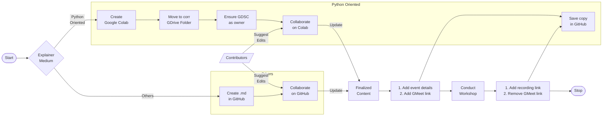

# 👋 Welcome!

## Contribution Guideline

## ✨ Contributors

## ⚠️ Disclaimers

If you want to publish this on your own, **make sure to give due credit**, to help support this project :)

## License

https://github.com/gdscbpdc/gdscbpdc.github.io/blob/6994f73a813007bc5ae105b16e4c9e58b64fbd56/license#L1-L21

