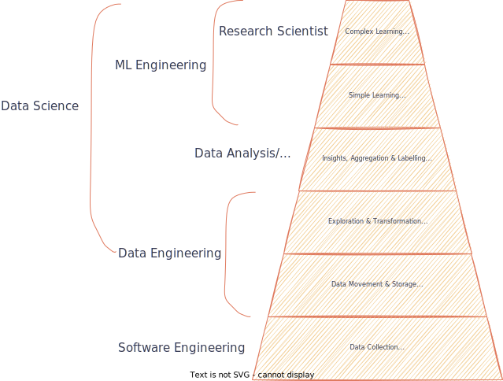

# Internship Talk: Data Science @ Emirates

Want to know what a data science intern does? 📊
 
Get to know all the intricacies of our very own Ahmed Thahir's PS1 role in Revenue Optimization at Emirates, one of the world’s leading airline carriers! ✈️

Organized by Ahmed Thahir

## Recording

Watch the [Recording](https://drive.google.com/file/d/1oLJLu7ZZ_RVAZpnjiAoyV_yJcDbwiSSS/view?usp=sharing)

## What is Data Science? 📊

## How I got in? 🤔

- Explore 
- Be curious 😮
- Do a lot of projects 👩‍💻👨‍💻
- Try to get a good CGPA 🏫, but not at the expense of your health
- Work hard 💪

## Experience 👨‍💻

- Initially sever imposter Syndrome 😰
- Luckily, everyone was friendly
- Eventually, got confident in my talent

## Internship Tips 📝

- Be curious
- Ask questions
- Note **everything** down
- Try to get something interesting out of boring tasks

## Tools & Technologies

- Python
- [Plotly](https://youtu.be/PqUaDvbczbI)
- [Streamlit](https://youtu.be/VqgUkExPvLY)
- [Dash](https://youtu.be/XOFrvzWFM7Y)
- [Snowflake SQL](https://youtu.be/9PBvVeCQi0w)

### Learning

Focus on doing project, don't get overwhelmed with these videos.

- [CodingIsFun](https://www.youtube.com/@CodingIsFun/videos)
- [DataProfessor](https://www.youtube.com/@DataProfessor/videos)
- [NicholasRenotte](https://www.youtube.com/@NicholasRenotte/videos)
- [Google AI & ML resources](https://ai.google/education)
- [Recall by Dataiku](https://www.youtube.com/@RecallbyDataiku/videos)
- [Deep Learning](https://www.youtube.com/@Deeplearningai/videos)
